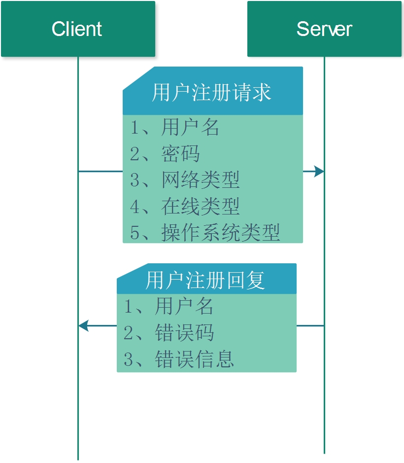

# 2.1 用户登陆

## 1. 流程图


## 2 请求和回复


1. 请求方式
POST


2. 请求URL
http://127.0.0.1:8000/user_login

3. JSON 请求

* 请求字段

| 编号 | 字段       | 类型   | 含义         | 备注                |
| ---- | ---------- | ------ | ------------ | ------------------- |
| 1    | UserName   | 字符串 | 用户名       | 必须填写            |
| 2    | Password   | 字符串 | 用户密码     | 必须填写            |
| 3    | NetType    | 整数   | 网络类型     | 4G,WiFi,网线        |
| 4    | OnlineType | 整数   | 在线类型     | 在线、隐身          |
| 5    | OsType     | 整数   | 操作系统类型 | Windows,Linux,MacOS |


* 请求示例

```json
{
	"NetType": 0,
	"OnlineType": 2,
	"OsType": 0,
	"Password": "AddFriend_AGREE@test1.com",
	"UserName": "AddFriend_AGREE@test1.com"
}
```

4. JSON回复

*  回复字段

| 编号 | 字段     | 类型     | 含义             | 备注     |
| ---- | -------- | -------- | ---------------- | -------- |
| 1    | UserName | 字符串   | 用户名           | 必须填写 |
| 2    | code     | 错误码   | 表示注册结果     | 必须填写 |
| 3    | message  | 错误信息 | 错误码的具体描述 | 必须填写 |


* 回复示例

```JSON
{
	"UserName": "AddFriend_AGREE@test1.com",
	"code": 5,
	"message": "Succeed"
}
```
