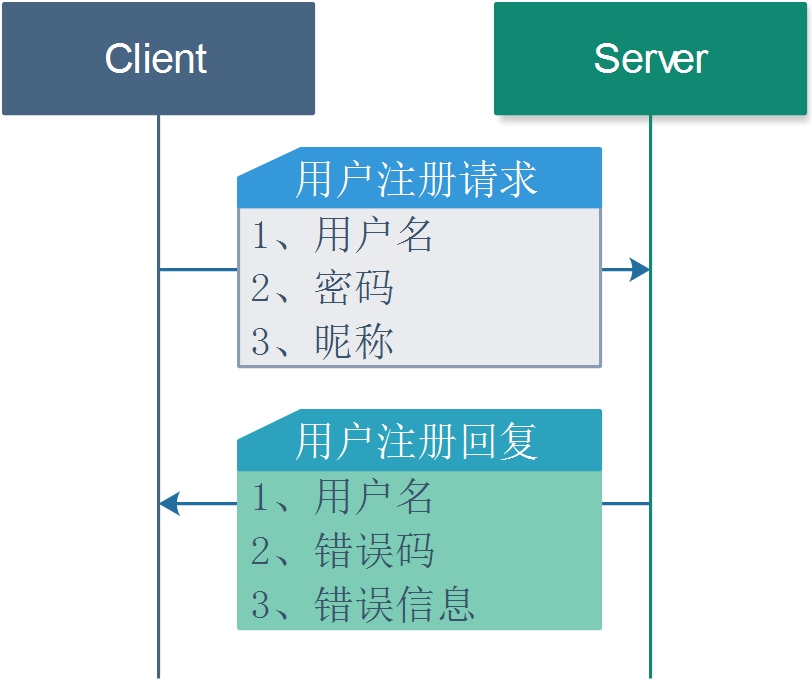

# 2.5 用户注册

## 1. 流程图


## 2. 请求和回复

用户注册需要提供的信息有三项

* 1 用户名
* 2 密码
* 3 用户昵称

如果用户没有输入昵称，默认用用户名作为昵称或者要求用户提供昵称。

### 1. 请求方式

POST

### 2. 请求URL

http://127.0.0.1:8000/user_register 


### 3. JSON请求

* JSON 请求

| 编号 | 字段     | 类型   | 含义     | 备注               |
| ---- | -------- | ------ | -------- | ------------------ |
| 1    | NickName | 字符串 | 用户昵称 | 未填写时和用户一致 |
| 2    | UserName | 字符串 | 用户名   | 必须填写           |
| 3    | Password | 字符串 | 用户密码 | 必须填写           |

* 请求示例

```json
{
	"NickName": "test1",
	"Password": "AddFriend_AGREE@test1.com",
	"UserName": "AddFriend_AGREE@test1.com"
}
```

### 4. JSON 回复

* JSON回复字段

| 编号 | 字段     | 类型     | 含义             | 备注     |
| ---- | -------- | -------- | ---------------- | -------- |
| 1    | UserName | 字符串   | 用户名           | 必须填写 |
| 2    | code     | 错误码   | 表示注册结果     | 必须填写 |
| 3    | message  | 错误信息 | 错误码的具体描述 | 必须填写 |

* 回复示例

```JSON
{
	"UserName": "AddFriend_AGREE@test1.com",
	"code": 5,
	"message": "Succeed"
}
```
