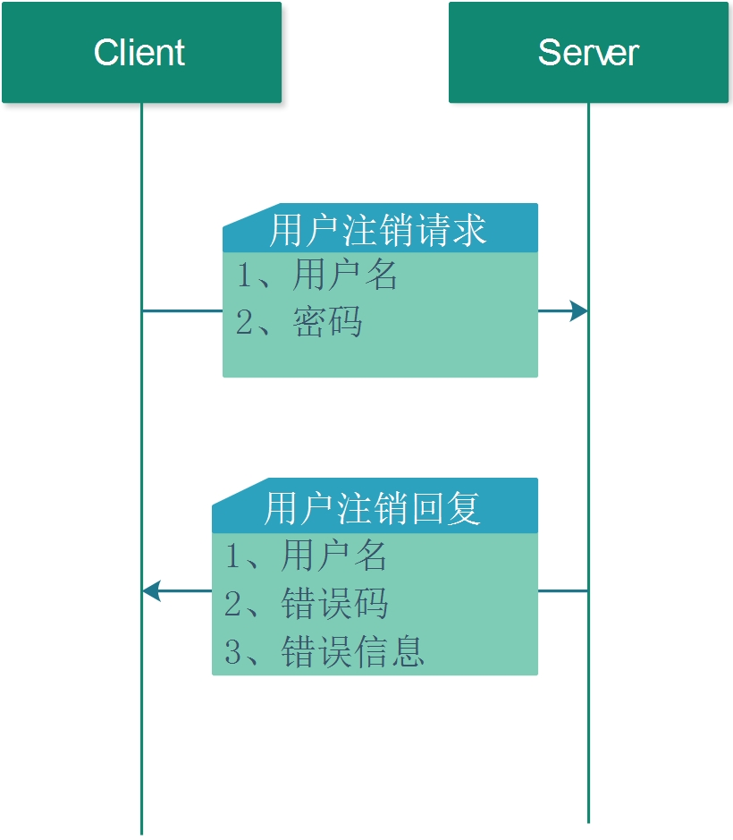

# 2.6 用户注销

## 1. 流程图


## 2 请求和回复

### 1. 请求方式

POST

### 2. 请求URL

http://127.0.0.1:8000/un_register_user

### 3. 请求的JSON 

如果用户没有输入昵称，默认用用户名作为昵称或者要求用户提供昵称。

* JSON 请求字段

| 编号 | 字段     | 类型   | 含义     | 备注     |
| ---- | -------- | ------ | -------- | -------- |
| 1    | UserName | 字符串 | 用户名   | 必须填写 |
| 2    | Password | 字符串 | 用户密码 | 必须填写 |

* 请求示例

```json
{
	"Password": "AddFriend_AGREE@test1.com",
	"UserName": "AddFriend_AGREE@test1.com"
}
```

### 4. JSON回复

1. JSON回复字段

| 字段     | 类型     | 含义             | 备注     |
| -------- | -------- | ---------------- | -------- |
| UserName | 字符串   | 用户名           | 必须填写 |
| code     | 错误码   | 表示注册结果     | 必须填写 |
| message  | 错误信息 | 错误码的具体描述 | 必须填写 |

2. 回复示例

```JSON
{
	"UserName": "AddFriend_AGREE@test1.com",
	"code": 5,
	"message": "Succeed"
}
```