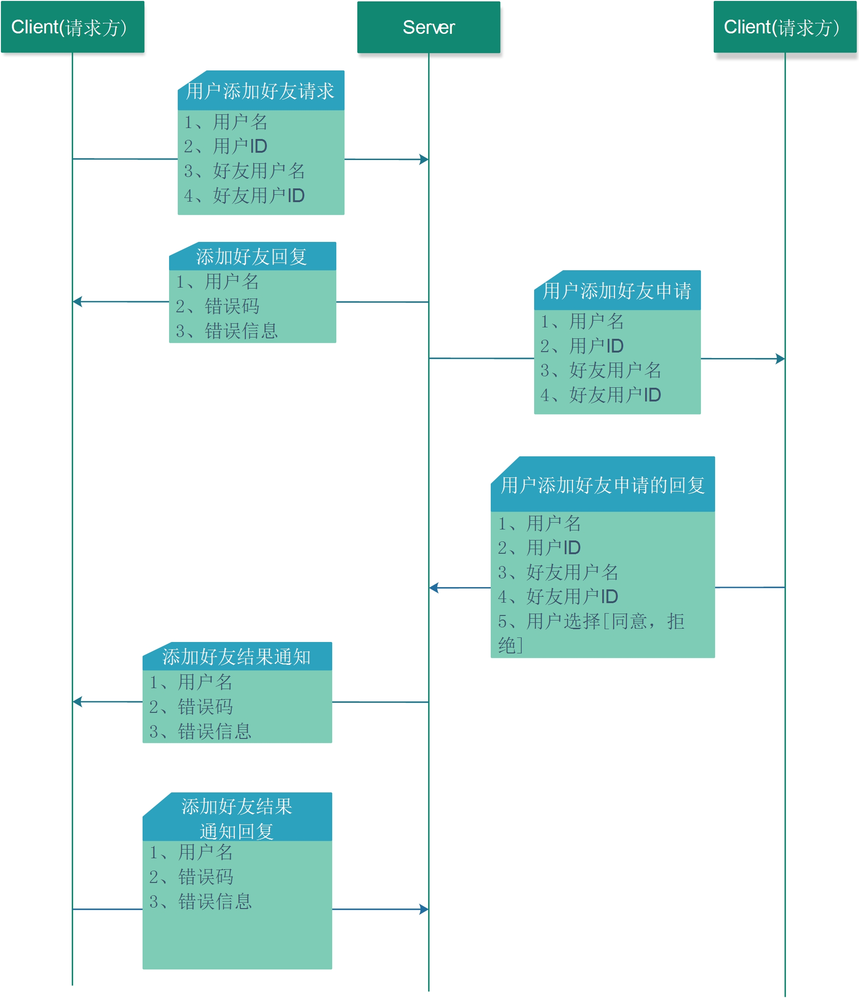

## 3.1 添加好友

添加好友的消息流程如下



### 3.1.1 发送添加好友请求

1. 请求方式  
POST 
2. 请求URL   
http://127.0.0.1:8000/send_add_friend_req

3. 请求JSON   

* 请求字段:

| 编号 | 字段     | 类型   | 含义   | 备注 |
| ---- | -------- | ------ | ------ | ---- |
| 1    | UserId   | 字符串 | 用户ID | 无   |
| 2    | FriendId | 字符串 | 好友ID | 无   |

* 请求示例:

```json
 {
    "FriendId": "68983552", 
    "UserId": "1874688"
}
```

4. 回复JSON

* 回复字段
  
| 编号 | 字段     | 类型   | 含义     | 备注 |
| ---- | -------- | ------ | -------- | ---- |
| 1    | UserId   | 字符串 | 用户ID   |      |
| 2    | FriendId | 字符串 | 好友ID   |      |
| 3    | Code     | 整数   | 错误码   |      |
| 4    | Message  | 字符串 | 错误信息 |      |
| 5    | MsgId    | 字符串 | 消息ID   |      |


* 回复示例
```json
{
   "Code" : 0,
   "FriendId" : "",
   "Message" : "Succeed",
   "MsgId" : "12230921392887177216",
   "UserId" : ""
}
```


### 3.1.2 添加好友申请

#### 3.1.2.1 获取申请

1. 请求方式    
GET 
2. 请求的URL     
http://127.0.0.1:8000/get_add_friend_require

3. 请求的JSON(无) 
4. 回复的JSON   

* JSON 字段

| 编号 | 字段     | 类型   | 含义   | 备注 |
| ---- | -------- | ------ | ------ | ---- |
| 1    | UserId   | 字符串 | 用户ID | 无   |
| 2    | FriendId | 字符串 | 好友ID | 无   |

* JSON示例
```json
{
   "FriendId" : "76718080",
   "MsgId" : "12230921461279371264",
   "UserId" : "56409856"
}
```

#### 3.1.2.2 响应申请
1. 请求方式    

POST
2. 请求URL     
http://127.0.0.1:8000/on_add_friend_require

3. 请求JSON

* JSON字段

| 编号 | 字段     | 类型   | 含义     | 备注 |
| ---- | -------- | ------ | -------- | ---- |
| 1    | UserId   | 字符串 | 用户ID   | 无   |
| 2    | FriendId | 字符串 | 好友ID   | 无   |
| 3    | Option   | 整数   | 用户选择 | 无   |

  
* JSON示例
```json  
{
    "FriendId": "76718080",
    "MsgId": "12230921461279371264",
    "Option": 1, 
    "UserId": "56409856"
}
```

1. Option解释 

### 3.1.3 获取添加结果通知

#### 3.1.3.1 获取通知

1. 获取方式     
GET
2. 获取URL     
http://127.0.0.1:8000/get_add_friend_notify
3. 请求的JSON(无)
 
4. 回复的JSON
* JSON字段

| 编号 | 字段     | 类型   | 含义     | 备注 |
| ---- | -------- | ------ | -------- | ---- |
| 1    | UserId   | 字符串 | 用户ID   | 无   |
| 2    | FriendId | 字符串 | 好友ID   | 无   |
| 3    | Option   | 整数   | 用户选择 | 无   |

* JSON示例
```json
{
   "FriendId" : "68983552",
   "MsgID" : "12230921375237419008",
   "Option" : 1,
   "UserId" : "1874688"
}
```

TODO://OPTION解释