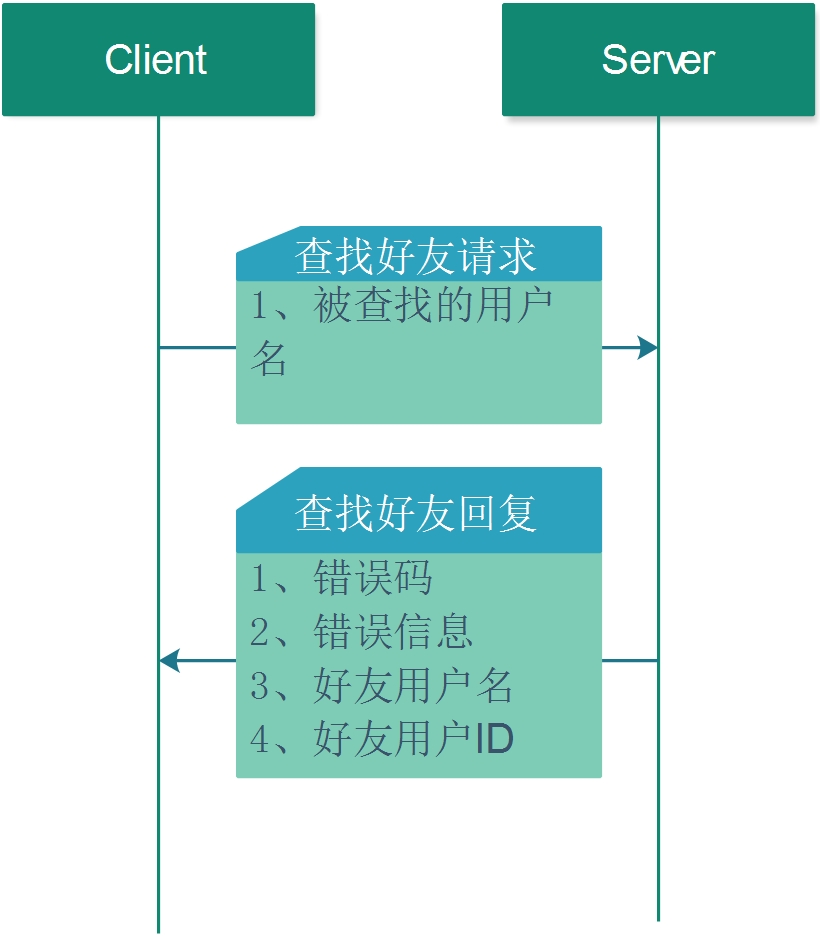

## 3.5 查找好友

查找好友的流程图如下



1. 请求方式     
POST

2. 请求URL     
http://127.0.0.1:8000/find_friend
3. 请求Json
* JSON字段     

| 字段       | 类型   | 含义         | 备注     |
| ---------- | ------ | ------------ | -------- |
| UserId     | 字符串 | 用户ID       | 必须填写 |
| WantedName | 字符串 | 查找的用户名 | 必须填写 |

* JSON示例
```json 
{
   "MsgId" : "",
   "UserId" : "18311111111",
   "WantedName" : "18311111111"
}
```

4. 回复Json

* JSON 字段

| 字段       | 类型       | 含义         | 备注                 |
| ---------- | ---------- | ------------ | -------------------- |
| Code       | 整数       | 错误码       | 必须填写             |
| UserId     | 字符串     | 用户ID       | 必须填写             |
| List       | JSON-array | 用户列表     | 每一项是一个用户信息 |
| Address    | 字符串     | 用户地址     | 必须填写             |
| BirthDate  | 字符串     | 用户生日     | 必须填写             |
| Email      | 字符串     | 用户邮箱     | 必须填写             |
| FaceId     | 字符串     | 用户头像编号 | 必须填写             |
| FriendId   | 字符串     | 用户ID       | 必须填写             |
| FriendName | 字符串     | 用户名称     | 必须填写             |
| Gender     | 字符串     | 用户性别     | 必须填写             |
| NickName   | 字符串     | 用户昵称     | 必须填写             |
| Signature  | 字符串     | 用户签名     | 必须填写             |

* JSON 示例

```json
{
   "Code" : 0,
   "List" : [
      {
         "Address" : "Test_User_Address",
         "BirthDate" : "19901010",
         "Email" : "test@dennisthink.com",
         "FaceId" : "2",
         "FriendId" : "60692224",
         "FriendName" : "18311111111",
         "Gender" : "",
         "NickName" : "鍝堝埄娉㈢壒",
         "Signature" : "涓汉鍗氬 https://www.dennisthink.com/"
      }
   ],
   "MsgId" : "",
   "UserId" : ""
}
```