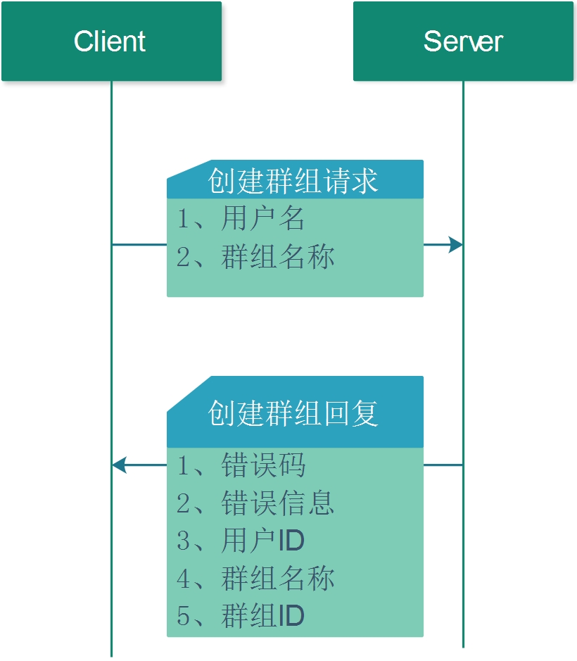

## 4.1 创建群组

创建群组的流程如下:



1. 请求方式    
POST
2. 请求URL     
http://127.0.0.1:8000/create_group

3. 请求JSON 

* JSON字段

| 编号 | 字段      | 类型   | 含义     | 备注 |
| ---- | --------- | ------ | -------- | ---- |
| 1    | UserId    | 字符串 | 用户ID   | 无   |
| 2    | GroupName | 字符串 | 群组名称 | 无   |

* JSON示例
```json
{
   "GroupName" : "赫敏的群",
   "MsgId" : "",
   "UserId" : "88404480"
}
```

4. 回复JSON 

* JSON 字段

| 编号 | 字段      | 类型   | 含义     | 备注 |
| ---- | --------- | ------ | -------- | ---- |
| 1    | Code      | 整数   | 错误码   |      |
| 2    | Message   | 字符串 | 错误信息 |      |
| 3    | UserId    | 字符串 | 用户ID   |      |
| 4    | GroupId   | 字符串 | 群组ID   |      |
| 5    | GroupName | 字符串 | 群组名称 |      |


* JSON 示例
```json
{
   "Code" : 0,
   "GroupId" : "90450944",
   "GroupName" : "赫敏的群",
   "Message" : "",
   "MsgId" : "",
   "UserName" : "88404480"
}
```  