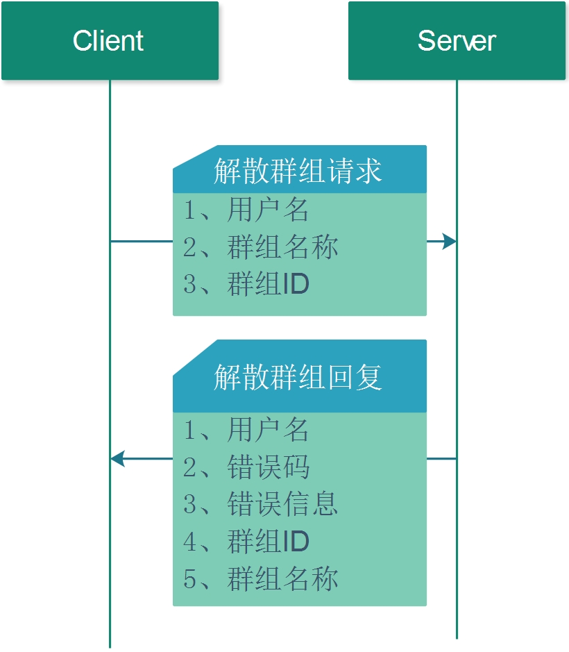

## 4.2 解散群组

解散群组的流程如下:


1. 请求方式   

POST 

2. 请求URL 

https://127.0.0.1:8000/destroy_group

3. 请求JSON 

* JSON字段

| 编号 | 字段      | 类型   | 含义     | 备注     |
| ---- | --------- | ------ | -------- | -------- |
| 1    | UserName  | 字符串 | 用户名   | 必须填写 |
| 2    | GroupId   | 字符串 | 群组ID   | 必须填写 |
| 3    | GroupName | 字符串 | 群组名称 | 必须填写 |


* JSON示例
```json
{
    "GroupId" : "88010240",
    "GroupName" : "TestGroup1",
    "MsgId" : "12230921613247520768",
    "UserName" : "11849472"
}
```

4. 回复JSON 

* JSON字段

| 编号 | 字段      | 类型   | 含义     | 备注     |
| ---- | --------- | ------ | -------- | -------- |
| 1    | Code      | 整型   | 错误码   | 必填     |
| 2    | GroupId   | 字符串 | 群组ID   |
| 3    | GroupName | 字符串 | 群组名称 |
| 4    | UserName  | 字符串 | 用户名   | 必须填写 |
| 5    | Message   | 字符串 | 错误信息 |          |

* JSON示例
```json
 {
    "Code" : 0,
    "GroupId" : "",
    "GroupName" : "",
    "Message" : "",
    "MsgId" : "12230921614770053120",
    "UserName" : ""
 }
```