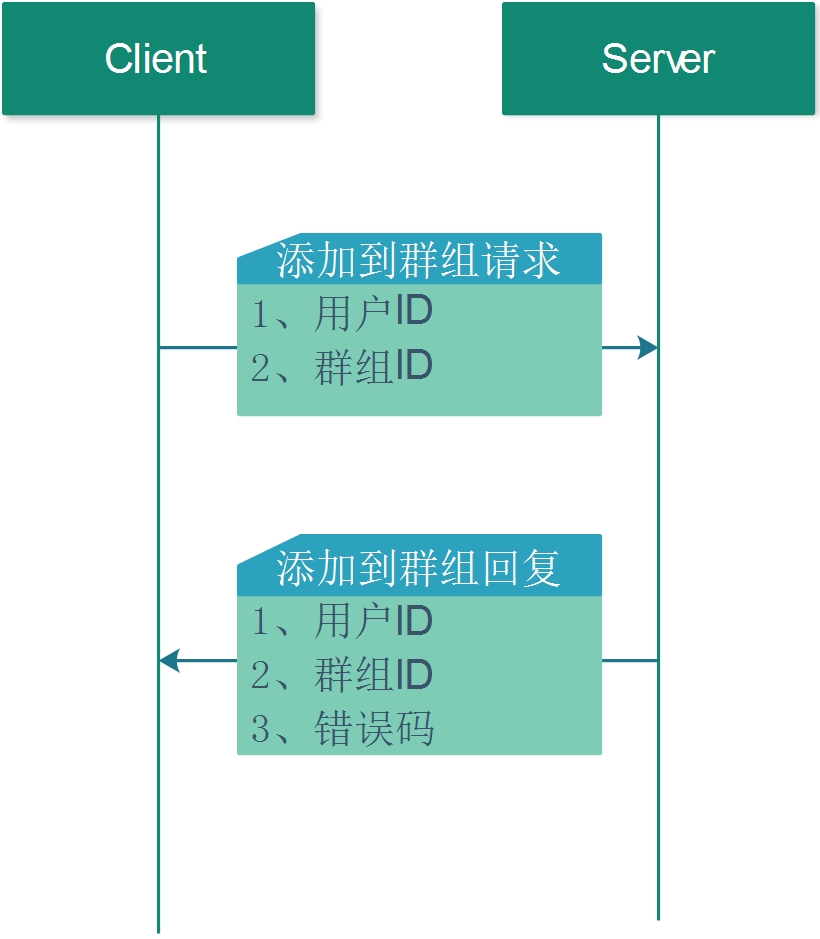

## 4.3 添加到群组

添加用户到群组的流程图如下所示:



1. 请求方式   

POST 

2. 请求URL 

http://127.0.0.1:8000/add_to_group

3. 请求JSON 

* JSON字段

| 编号 | 字段     | 类型   | 含义   | 备注 |
| ---- | -------- | ------ | ------ | ---- |
| 1    | UserName | 字符串 | 用户ID | 必填 |
| 2    | GroupId  | 字符串 | 群组ID | 必填 |

* JSON示例

```json
 {
    "GroupId" : "90450944",
    "MsgId" : "",
    "UserName" : "60692224"
 } 
```

4. 回复JSON 

* JSON字段

| 编号 | 字段     | 类型   | 含义   | 备注     |
| ---- | -------- | ------ | ------ | -------- |
| 1    | Code     | 整型   | 错误码 | 必须填写 |
| 2    | UserName | 字符串 | 用户名 | 必须填写 |
| 3    | GroupId  | 字符串 | 群组ID | 必须填写 |

* JSON示例

```json
{
    "Code" : 0,
    "GroupId" : "85914880",
    "MsgId" : "",
    "UserName" : "93755392"
}
```