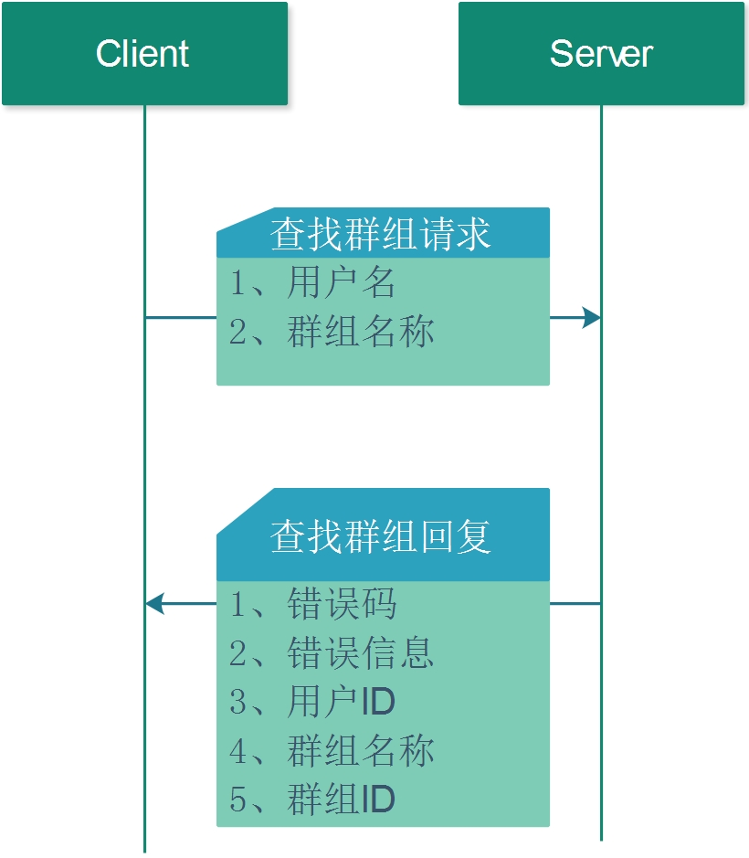

## 4.9 查找群组

查找群组的流程图如下:



1. 请求方式
POST 

2. 请求URL 
http://127.0.0.1:8000/find_group

3. 请求JSON 

* JSON字段

| 编号 | 字段     | 类型   | 含义   | 备注     |
| ---- | -------- | ------ | ------ | -------- |
| 2    | UserName | 字符串 | 用户ID | 必须填写 |
| 3    | GroupId  | 字符串 | 群组ID | 必须填写 |

* JSON示例
```json
{
   "GroupName" : "DennisThink",
   "MsgId" : "",
   "UserName" : "60692224"
}
```

4. 回复JSON 

* JSON字段

| 编号 | 字段       | 类型   | 含义         | 备注     |
| ---- | ---------- | ------ | ------------ | -------- |
| 1    | code       | 错误码 | 查找结果     | 必须填写 |
| 2    | UserName   | 字符串 | 用户ID       | 必须填写 |
| 3    | GroupId    | 字符串 | 群组ID       | 必须填写 |
| 4    | GroupName  | 字符串 | 群组名称     | 必须填写 |
| 5    | GroupOwner | 字符串 | 群组的创建者 | 必须填写 |

* JSON示例

```json
{
   "Code" : 0,
   "GroupId" : "90450944",
   "GroupName" : "璧晱鐨勭兢",
   "GroupOwner" : "",
   "MsgId" : "",
   "UserName" : "60692224"
}
```