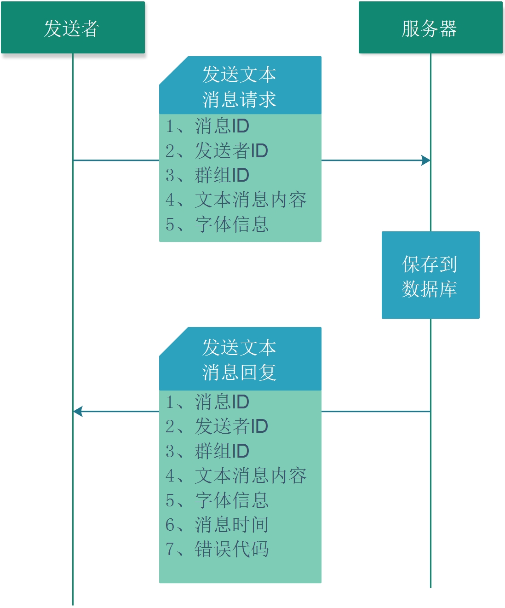

## 6.1.1 发送群组文本聊天消息到服务器

发送群组文本聊天消息到服务器的流程如下:


1. 请求方式
POST

2. 请求URL
http://127.0.0.1:8000/send_group_text_msg

3. 请求JSON

* JSON字段

| 编号 | 字段     | 类型   | 含义                 | 备注 |
| ---- | -------- | ------ | -------------------- | ---- |
| 1    | Context  | 字符串 | 文本消息内容UTF8格式 |      |
| 2    | FontInfo | 字符串 | 字体信息的JSON字符串 |      |
| 3    | GroupId  | 字符串 | 群组ID               |      |
| 4    | SenderId | 字符串 | 发送者的消息ID       |      |

* JSON示例
```json
{
    "Context" : "HTTP_SendGroupMsg",
    "FontInfo" : "{\"FontColor\": \"000000\", \"FontName\": \"\", \"FontSize\": 9, \"FontStyle\": 0}",
    "GroupId" : "9879296",
    "MsgId" : "12230921614686167040",
    "Sender" : "91112192"
}
```  

4. 回复JSON

* JSON字段

| 编号 | 字段     | 类型   | 含义                 | 备注 |
| ---- | -------- | ------ | -------------------- | ---- |
| 1    | Context  | 字符串 | 文本消息内容UTF8格式 |      |
| 2    | FontInfo | 字符串 | 字体信息的JSON字符串 |      |
| 3    | GroupId  | 字符串 | 群组ID               |      |
| 4    | SenderId | 字符串 | 发送者的消息ID       |      |
| 5    | MsgTime  | 字符串 | 消息时间             |      |
| 6    | Code     | 整数   | 错误代码             |      |

* JSON示例

```json
{
   "Code" : 0,
   "Context" : "ddddddddddd       ",
   "FontInfo" : "{\"FontColor\": \"000000\", \"FontName\": \"寰蒋闆呴粦\", \"FontSize\": 12, \"FontStyle\": 0}",
   "GroupId" : "90450944",
   "MsgId" : "",
   "MsgTime" : "2019-10-16 15:34:16 ",
   "Sender" : "88404480"
}
```